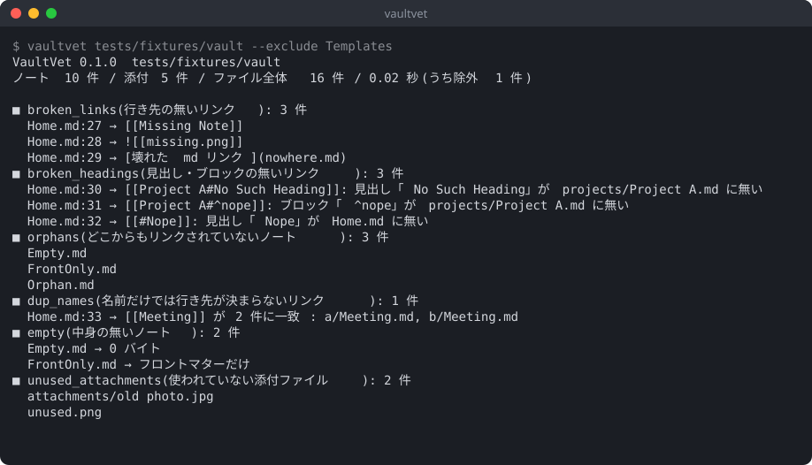

# Obsidian(VaultVet)

Obsidian の vault を**読むだけ**で点検して、あとで困るもの(壊れたリンク、孤立したノート、
使われていない添付ファイルなど)を一覧にするコマンドラインの道具です。
vault の中には何も書きません。特定のフォルダ構成を前提にしないので、どの vault にも使えます。

> Obsidian の公式ツールではありません。Obsidian 本体やプラグインとは関係なく、vault のファイルを外から読むだけです。

## 何を調べるか

| 検査 | 内容 |
| --- | --- |
| `broken_links` | 行き先の無いリンク。`[[note]]` `[[note\|表示名]]` `[[note#見出し]]` `[[note#^block]]` `![[埋め込み]]` `[text](path.md)`(URL エンコードされたパスも) |
| `broken_headings` | ノートはあるが、`#見出し` や `#^ブロックID` がそのノートに無いリンク |
| `orphans` | どこからもリンクされていないノート |
| `dup_names` | 同じファイル名のノートが複数あり、パス無しの `[[名前]]` がどれを指すか曖昧なリンク |
| `empty` | 中身が空(0 バイト、空白だけ、フロントマターだけ)のノート |
| `unused_attachments` | どこからも参照されていない添付ファイル(画像・音声・動画・PDF) |

リンクの行き先は Obsidian と同じ考え方で探します。

- `.md` は省略できる。大文字小文字は区別しない(Unicode の NFC/NFD の違いもそろえる)
- パス付き(`[[folder/note]]`)とパス無し(`[[note]]`)。パス無しは同じフォルダ → いちばん短いパスの順
- `./` `../` で始まる相対パス、vault の根からのパス
- フロントマターの `aliases`(`aliases: [a, b]` と `- a` の並びの両方)
- 拡張子つきの添付ファイル(`![[diagram.png]]`、`[[report.pdf#page=2]]`)
- `.canvas` のファイルノードと、テキストノードの中のリンクも「参照」として数える
- フロントマターのプロパティに書いた `"[[note]]"` もリンクとして数える
- 見出しリンクは記号を空白とみなして比べる。GitHub 形式の `#見出しの-slug` も通す

数えないもの:

- コードブロック(``` と ~~~)、インラインコード、`<code>` の中のリンク
- `http:` `mailto:` `obsidian:` など、スキームの付いたリンク
- `.obsidian/` `.trash/` `.git/` などドットで始まるフォルダとファイル
- シンボリックリンクとジャンクションの先(辿らない)

## 画面



(`tests/fixtures/vault` の架空の vault で回した例です)

## 動作環境

- Linux(Arch Linux で確認)。Windows・macOS でも動くはずですが、主な対象は Linux です
- Python 3.11 以上
- 依存ライブラリなし(標準ライブラリだけ)

## 入れ方

pipx で入れる:

```sh
pipx install git+https://github.com/takosasi-dev/obsidian-vault-vet
vaultvet --version
```

clone してそのまま使う:

```sh
git clone https://github.com/takosasi-dev/obsidian-vault-vet
cd obsidian-vault-vet
python -m vaultvet /path/to/vault
```

## 使い方

```sh
vaultvet /path/to/vault                                   # 全部の検査、テキストで
vaultvet /path/to/vault --only broken_links,orphans --json
vaultvet /path/to/vault --format markdown --out ~/vault-report.md
vaultvet /path/to/vault --exclude Templates --exclude "Archive/*"
```

| 引数 | 意味 |
| --- | --- |
| `--only a,b` | 走らせる検査をカンマ区切りで選ぶ(既定は全部) |
| `--exclude GLOB` | 見ないパス。vault からの相対パス(`Archive/*`)かファイル・フォルダの名前(`Templates`)に当てる。何度でも指定できる |
| `--json` / `--format json` | JSON で出す |
| `--format markdown` | Markdown で出す(別の場所のノートに貼る用) |
| `--out PATH` | 結果をファイルに書く。vault の中を指していたら拒否する |

除外したノートは読まず、検査の結果にも出しません。ただしリンクの行き先としては残すので、
除外したフォルダへのリンクは壊れたリンクになりません。

終了コード:

| コード | 意味 |
| --- | --- |
| 0 | 何も見つからなかった |
| 1 | 何か見つかった |
| 2 | 引数の誤り、vault が無い、`--out` が vault の中 |

JSON の形:

```json
{
  "tool": "vaultvet",
  "version": "0.1.0",
  "vault": "/path/to/vault",
  "stats": {"notes": 10, "attachments": 5, "files": 16, "excluded": 0, "seconds": 0.02},
  "unreadable": [],
  "checks": {
    "broken_links": {"count": 1, "items": [{"file": "Home.md", "line": 27, "detail": "[[Missing Note]]"}]},
    "orphans": {"count": 1, "items": [{"file": "Orphan.md", "line": null, "detail": ""}]}
  }
}
```

`line` はファイル単位の検査(`orphans` `empty` `unused_attachments`)では `null` です。
読めなかったファイルは `unreadable` に並びます(0 件として誤魔化しません)。

### WSL から Windows 側の vault を読む

Windows に置いた vault も、WSL の Linux からそのまま読めます。

```sh
vaultvet /mnt/c/Users/<名前>/Documents/MyVault
vaultvet /mnt/e/Notes --json > /tmp/vault.json
```

`/mnt/...` 越しのファイルアクセスは1回ごとの待ちが長いので、フォルダの一覧と読み込みを
スレッドで並べて待ちます。千件ほどのノートで、WSL から 1〜2 秒で終わります。

## 安全面の注意

- vault の中には何も書きません(一時ファイルもキャッシュも作りません)。`--out` が vault の中を指すと終了コード 2 で止まります
- ファイルはそれぞれ1回読むだけです。Obsidian が開いている最中に走らせても構いません
- 結果にはノートのファイル名やリンクの文字列がそのまま入ります。人に見せる前に中身を確かめてください

## 既知の限界

- 見出しは `#` で始まる形(ATX)だけを見ます。`===` `---` で下線を引く形は見ません
- `%% コメント %%` と HTML コメントの中のリンクも数えます
- 入れ子の見出しリンク `[[note#親#子]]` は、最後の見出しがあるかだけを見ます
- 除外したノートの中の見出しは読まないので、除外したノートへの見出しリンクは調べません
- `.canvas` の中の壊れた参照は報告しません(参照として数えるだけ)
- HTML の `` は参照として数えません

## ライセンス

MIT。[LICENSE](LICENSE) を見てください。

## 開発状況

v0.1.0。変更の記録は [CHANGELOG.md](CHANGELOG.md) にあります。

テスト:

```sh
python tests/run_all.py
```
